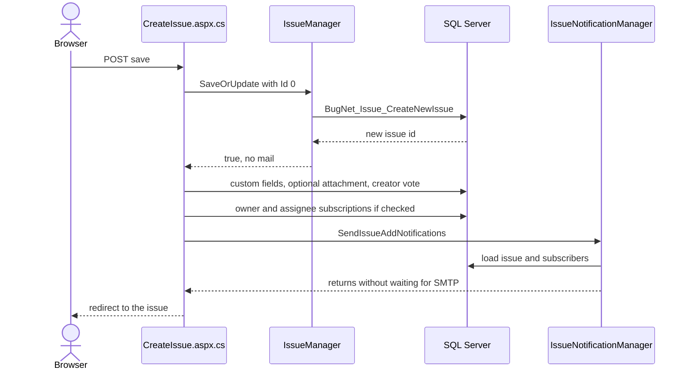

# Creating an issue and its notification email

`Webservices/BugNetServices.asmx` does not create an issue, and it does not send the new-issue email. The live WSDL on the dry-run host matches the source. The operation list is `ValidIssue`, `CreateNewIssueRevision`, `CreateNewIssueAttachment`, `RenameCategory`, `MoveCategory`, `GetCategories`, `AddCategory`, `DeleteCategory`, `GetResolutions`, `GetMilestones`, `GetIssueTypes`, `GetPriorities`, `GetStatus`, `GetProjectId`, `GetProjectIssues`, `LogIn`, and `LogOut`.

A new issue is created by the WebForms page `Issues/CreateIssue.aspx`. `SaveIssue` inserts the row through `IssueManager.SaveOrUpdate`, which sends no mail on insert, and then calls `IssueNotificationManager.SendIssueAddNotifications`. The POP3 mailbox reader is the only other caller of that email method. In this checkout the reader is not registered, so a normal web create is the path that actually sends the mail.

This note is a code map. No issue was created against the live host, and no behaviour was recorded or labelled.

## What the SOAP service does

The service class is `BugNET.Webservices.BugNetServices` in `src/BugNET_WAP/Webservices/BugNetServices.asmx.cs`. It inherits `LogInWebService`. The SOAP namespace is `http://bugnetproject.com/`. Bindings are SOAP 1.1 and 1.2, document/literal wrapped. `[ScriptService]` also exposes each method as JSON at `BugNetServices.asmx/<Method>`.

`LogIn` calls `Membership.ValidateUser` and stores `Session["IsAuthenticated"]` and `Session["UserName"]`. It does not issue the `BugNET` forms-authentication cookie. A later call has to send the session cookie back. `LogOut` clears those session values.

Every method except `GetCategories`, `LogIn`, and `LogOut` has `[PrincipalPermission(SecurityAction.Demand, Authenticated = true)]`. On each request the base constructor leaves a forms-authenticated user alone. Otherwise, if the session flag is set, it puts a role-less `GenericPrincipal` on `Thread.CurrentPrincipal`. Methods that touch an existing issue also reject a private project unless `ProjectManager.IsUserProjectMember` passes for the session user name.

| Group | Operations | What they write | Mail |
| --- | --- | --- | --- |
| Session | `LogIn`, `LogOut` | Session flags only | No |
| Existing-issue children | `CreateNewIssueRevision`, `CreateNewIssueAttachment` | One `BugNet_IssueRevisions` or `BugNet_IssueAttachments` row for an issue that already exists. File-system storage also writes the bytes to disk. | No |
| Categories | `AddCategory`, `RenameCategory`, `MoveCategory`, `DeleteCategory` | Category rows through `CategoryManager` | No |
| Reads | `ValidIssue`, `GetCategories`, `GetResolutions`, `GetMilestones`, `GetIssueTypes`, `GetPriorities`, `GetStatus`, `GetProjectId`, `GetProjectIssues` | Nothing | No |

`CreateNewIssueRevision` loads the issue, checks the private-project rule, and calls `IssueRevisionManager.SaveOrUpdate`. That runs `BugNet_IssueRevision_CreateNewIssueRevision`. `CreateNewIssueAttachment` does the same project check and calls `IssueAttachmentManager.SaveOrUpdate`. Neither method calls `IssueManager.SaveOrUpdate` or `IssueNotificationManager`.

The in-repo clients match that scope. The Subversion hook calls `LogIn` and `CreateNewIssueRevision`. The Mercurial hook calls `ValidIssue` and `CreateNewIssueRevision`. The category tree in `ProjectCategories.ascx` calls `AddCategory`, `RenameCategory`, `MoveCategory`, and `GetCategories` over JSON.

Deleting an attachment is a different path. `IssueAttachmentManager.Delete` writes history and calls `SendIssueNotifications` with the change list. That is the update email, not the add email, and the SOAP service has no delete-attachment method.

## How a new issue is saved

The page route is `~/Issues/CreateIssue/{projectId}`. `BasePage.OnInit` runs on the first request and on postback. It sends an anonymous user to login when the `AnonymousAccess` host setting is off. It shows not-found for an unknown project. It blocks a private project for anonymous users and for non-members who are not super users.

On the first GET, `Page_Load` checks `UserManager.HasPermission(ProjectId, "AddIssue")`, fills the dropdowns, defaults the owner to the current user, and applies the project's default values, including the two notify checkboxes. `SaveIssue` does not check `AddIssue` again.

`LnkSaveClick` and `LnkDoneClick` both require `Page.IsValid`, then call `SaveIssue`. On success they redirect to `IssueDetail.aspx?id=` or back to the previous page. `SaveIssue` has no transaction and no try/catch. The steps are:

1. Build an `Issue` with `Id = 0` and `CreatorUserName = Security.GetUserName()`. The title is passed through `Server.HtmlEncode`. The description is stored as the editor HTML.
2. `IssueManager.SaveOrUpdate` sees `Id <= 0` and calls `SqlDataProvider.CreateNewIssue`, which runs `BugNet_Issue_CreateNewIssue`. The procedure resolves user names to ids, inserts `BugNet_Issues`, and returns `scope_identity()`. The insert branch returns `true` and does not write history or send mail. A false result shows `SaveIssueError` and stops.
3. `CustomFieldManager.SaveCustomFieldValues`. A failure stops here. The issue row is already committed.
4. If a file was posted, `IssueAttachmentManager.IsValidFile` runs. An invalid extension stops the method. A valid file calls `IssueAttachmentManager.SaveOrUpdate`. A false result shows an error and does not stop the rest of the save.
5. `IssueVoteManager.SaveOrUpdate` records the creator's vote. A failure stops here, before subscriptions and before the email.
6. If the notify-owner box is checked and the owner exists, insert a `BugNet_IssueNotifications` row. Same for the assignee when that box is checked. The return values are ignored.
7. Always call `IssueNotificationManager.SendIssueAddNotifications(issue.Id)`.

`IssueManager.SaveOrUpdate` only sends mail on the update branch, and only when `HttpContext.Current` is set. That branch calls `SendIssueNotifications` with the change list, and `SendNewAssigneeNotification` when the assignee changed. The mailbox reader's second save, the one that rewrites inline images, is an update with no HTTP context, so it takes the branch that only calls `UpdateIssue`.

The create call passes `@IssueTitle` as `NVarChar(255)` in `SqlDataProviderIssues.cs`. The update call and the column use 500. A long encoded title is truncated on insert.

Other insert callers do not send the add email. `DataProvider.CreateNewIssue` is only reached from `IssueManager.SaveOrUpdate`. Test helpers and the data generator insert issues and stop there.

## How the new-issue email is built

`SendIssueAddNotifications` is the only builder of the add email. Its two callers are `CreateIssue.SaveIssue` and `MailboxReader.SendNotifications`.

1. Reject `issueId <= 0`. Construct `SmtpMailDeliveryService`.
2. Reload the issue with `GetIssueById`, so the project code and name come from the database. Load recipients with `GetIssueNotificationsByIssueId`. Read host setting `SMTPEMailFormat`, defaulting to text.
3. The recipient procedure unions two sets. Issue subscribers come from `BugNet_IssueNotifications` joined to `Users` and `Memberships`, with a left join to `BugNet_UserProfiles`. Project subscribers come from `BugNet_ProjectNotifications` for the issue's project. That second select inner-joins `BugNet_UserProfiles`, so a project subscriber with no profile row is dropped. The result is `SELECT DISTINCT` on user, display name, email, and culture. Culture is `PreferredLocale`, or host setting `ApplicationDefaultLanguage` when the profile has none.
4. For each distinct culture, load template keys `IssueAddedSubject` and `IssueAdded` or `IssueAddedHTML`. The HTML suffix is used when `SMTPEMailFormat` is HTML. In `Notifications.resx` the subject is `Issue {0} has been added to a project you are monitoring.` The body values are paths, `Text\IssueAdded.xslt` and `Html\IssueAdded.xslt`, under the template root from `SMTPEmailTemplateRoot`, default `~/templates`.
5. For each recipient, inside a try/catch that only logs, skip the user when `MembershipUser.IsApproved` is false or when profile flag `ReceiveEmailNotifications` is false. That flag defaults to true. The line that would skip the creator is commented out, so the creator is not removed.
6. Format the subject with `issue.FullId` as `{0}`. `FullId` is `ProjectCode-Id`. The second format argument, `ProjectName`, has no `{1}` in the English subject. Transform the body with the issue as XML.
7. Build a `MailMessage` with `IsBodyHtml = true` for both text and HTML formats. Call `SmtpMailDeliveryService.Send` and do not wait for it.

`SmtpMailDeliveryService.Send` sets To, then From. From is host setting `HostEmailAddress`, with display name `ApplicationTitle`. When `Pop3AllowReplyToEmail` is on, it inserts `+iid-{issueId}` before the `@`. It builds an `SmtpClient` from `SMTPServer`, `SMTPPort`, `SMTPUseSSL`, and optional `SMTPUsername`, `SMTPPassword`, and `SMTPDomain`. It then runs `client.SendAsync` inside `Task.Run`. `SendCompleted` logs transport errors and disposes the client. Exceptions thrown before that task, such as a missing host address, fault a task that nobody observes.

Who receives the mail:

- The owner, when the notify-owner box was checked and that user exists.
- The assignee, when the notify-assignee box was checked and that user exists.
- Every project subscriber returned by the procedure, even when both boxes are unchecked.

Each of those users must be approved and must not have opted out. The send does not read `Issue.Visibility`.

Checked-in mail transport is a pickup directory, not SMTP. `src/BugNET_WAP/Web.config` and `Web.Debug.config` set `deliveryMethod="SpecifiedPickupDirectory"` with folder `C:\Email`. `Web.Release.config` removes the `mailSettings` section, so a Release transform uses the default network SMTP client and the host SMTP settings. The running site's transformed config was not read, so it is unknown which of those the dry-run VM uses.

The mailbox path is written and not wired up. `MailboxReader.ProcessNewIssue` calls `SaveMailboxEntry` and then `SendNotifications`. `SendNotifications` subscribes the owner and assignee from project defaults `OwnedByNotify` and `AssignedToNotify`, then calls `SendIssueAddNotifications`. The compiled host is `MailboxReaderModule`, an `IHttpModule` driven by a timer. Both module registrations in `Web.config` are commented out. `POP3Settings.ascx.cs` shows `MailboxReaderModuleMissing` when POP3 is enabled and the module is absent. `MailBoxReaderJob.cs` is a Quartz `IJob` in the mailbox project folder, and it is not included in `BugNET.MailboxReader.csproj`.

Two copies of the recipient procedure disagree about null emails. `src/BugNET.Database/Stored Procedures/BugNet_IssueNotification_GetIssueNotificationsByIssueId.sql` requires `Email IS NOT NULL` on both selects. `src/BugNET_WAP/Providers/DataProviders/SqlDataProvider/BugNet.Schema.SqlDataProvider.sql` does not. Which copy is installed on the VM was not queried.

## Why the email sits outside SaveOrUpdate

The history explains the notification split. It does not explain the missing SOAP create operation.

- **[Direct]** No revision of `BugNetServices.asmx.cs` has a create-issue WebMethod. The import commit `553efc54` (2011-09-24, "first commit") already has the service without one. `5c746212` (2012-10-01) adds `ValidIssue` and the changeset and branch parameters on `CreateNewIssueRevision`. `git log -S` finds no `public bool CreateNewIssue(` or `public int CreateNewIssue(`.
- **[Supported]** The project's own text frames the service around source-control hooks and the category tree. The `5c746212` release notes describe the Subversion hook calling the web service to create revisions. The hook projects and `ProjectCategories.ascx` are the in-repo callers. Upstream issues [#138](https://github.com/dubeaud/bugnet/issues/138) and [#167](https://github.com/dubeaud/bugnet/issues/167) show outside users calling the service for reads and login. Neither asks for issue creation.
- **[Direct]** The add-mail call was removed from the manager to stop duplicate notifications. At `553efc54`, `IssueManager.SaveIssue` sent the add email on insert, and the issue page sent it again. Commit `31effaca` (2011-12-15, "fixes for duplicate notifications, duplicate code adding issue vote") deletes the manager's vote and add-mail calls and keeps the page send.
- **[Supported]** The duplicate was the manager send plus the page send on the same create. In the parent of `31effaca`, the page calls `SaveOrUpdate` and later calls `SendIssueAddNotifications` again. The commit message does not name the two call sites.
- **[Direct]** The page call at HEAD is that 2011 call, moved. `71802844` (2013-03-16, "refactored new issue to its own page") copies the create flow, including the send, into `CreateIssue.aspx.cs`. `253854cd` (2013-03-17) deletes the new-issue flow from `IssueDetail.aspx.cs`. No later commit puts add-mail back into `SaveOrUpdate`.
- **[Direct]** The `HttpContext.Current` guard on the update branch is for the mailbox reader. `b92e1076` (2012-09-01) adds the comment that the mailbox reader updates an issue to fix inline images and has no HTTP context, and that the reader is creating and updating in the same pass so "we are not missing anything." The same commit stops the mailbox module from restoring `HttpContext.Current` on its timer thread. It does not change the insert branch.
- **[Direct]** The mailbox reader's call exists because of a reported bug. Issue [#82](https://github.com/dubeaud/bugnet/issues/82) says people who should receive notifications for new issues received none. Pull request [#84](https://github.com/dubeaud/bugnet/pull/84), merged 2015-02-15, says it adds notifications for issues created by email. Commit `1c6a141f` calls `SendNotifications` after `SaveMailboxEntry`.
- **[Direct]** Pull request #84 comments out the add-mail creator skip because `Security.GetUserName()` throws when there is no current user. The skip was added in `f5df99a2` (2012-07-27, "Do not send notifications to the user that creates or changes issue"). The same `1c6a141f` change switches template path mapping from `HttpContext.Current.Server.MapPath` to `HostingEnvironment.MapPath`.
- **[Inferred]** `31effaca` likely caused the #82 symptom. Before that commit, mailbox-created issues received add-mail through the manager. After it, nothing on that path sent mail until 2015. Neither #82 nor `31effaca` mentions the other, and it is unverified whether mailbox add-mail actually worked before December 2011.
- **[Inferred]** The split appears to be a stack of local fixes. The 2011 change kept the page copy. The 2013 refactor carried it. The 2015 fix copied the page again into the reader. No commit states a rule that create mail belongs with the caller.
- **[Unknown]** Why the service never had a create-issue method. Every revision of the file, the release notes, the hook READMEs, the checked-in WSDLs, all 217 upstream issue bodies on `dubeaud/bugnet`, and the 28 pull requests were searched. None states a reason. The design predates the 2011 import. CodePlex does not resolve. Issue [#75](https://github.com/dubeaud/bugnet/issues/75) asks for an ASP.NET Web API for extensions, and it is still open. It was filed in 2015, years after the gap, and it does not mention issue creation, so it does not explain the original scope.

`bkarciauskas/bugnet` is a fork of `dubeaud/bugnet` with GitHub issues disabled. Commit notes `#170` and `#198` predate that GitHub repo and do not match its issue numbers. `#82` does match, because pull request #84 contains `1c6a141f`.

Sources that were not searched, because they are not this project's record: Notion and Google Drive, Slack, Datadog, Linear, and Databricks, Hex, and Statsig. No Sentry MCP is available in this environment.

## Gotchas that change the email

- A failure after the insert returns before the email, and the issue row stays. The next click inserts another issue, because each attempt starts at `Id = 0`. Custom-field failure, an invalid attachment, and a vote failure all stop before `SendIssueAddNotifications`.
- An exception inside `SendIssueAddNotifications` is not turned into `SaveIssue` returning false. Template load sits outside the per-recipient catch. A missing resource, template folder, or xslt file escapes the click handler after the row, the vote, and the subscriptions exist.
- Per-recipient send failures are logged by `ProcessException` and not rethrown. The method comment says it rethrows. It does not. Failures inside `Send` before the awaited task are not observed by the page.
- `IsBodyHtml` is always true, so a text-format body is still sent as HTML.
- The notify checkboxes do not decide the full recipient list. Project subscribers are added by the SQL procedure at send time. The creator is not excluded. The owner defaults to the creator with notify-owner checked, so the creator often receives the mail.
- SOAP `CreateNewIssueAttachment` writes no history and sends no mail. The attachment control on the issue detail page does send the update email.

## Where the code lives

| Concern | Path |
| --- | --- |
| SOAP endpoint | `src/BugNET_WAP/Webservices/BugNetServices.asmx.cs` |
| SOAP login | `src/BugNET_WAP/Webservices/LogInWebService.cs` |
| Create page | `src/BugNET_WAP/Issues/CreateIssue.aspx.cs`, method `SaveIssue` |
| Insert versus update | `src/BugNET.BLL/IssueManager.cs`, method `SaveOrUpdate` |
| SQL insert | `src/Library/Providers/DataProviders/SqlDataProvider/SqlDataProviderIssues.cs`, procedure `BugNet_Issue_CreateNewIssue` |
| Add email | `src/BugNET.BLL/IssueNotificationManager.cs`, method `SendIssueAddNotifications` |
| Recipients | `src/BugNET.Database/Stored Procedures/BugNet_IssueNotification_GetIssueNotificationsByIssueId.sql` |
| Templates | `src/BugNET_WAP/App_GlobalResources/Notifications.resx`, `src/BugNET_WAP/Templates/Html/IssueAdded.xslt`, `src/BugNET_WAP/Templates/Text/IssueAdded.xslt` |
| SMTP | `src/BugNET.BLL/Notifications/SmtpMailDeliveryService.cs` |
| Pickup directory | `src/BugNET_WAP/Web.config`, removed by `Web.Release.config` |
| Mailbox caller | `src/BugNET.MailboxReader/MailboxReader.cs` |
| Unregistered module | `src/Library/HttpModules/MailBoxReader/MailboxReaderModule.cs` |

## What this does not settle

The live operation list was read from the WSDL. The live database procedure, the transformed `Web.config` on the VM, and whether the mailbox module is enabled there were not read. Nothing in this pass created an issue or captured a message. Behaviour labels are not assigned here.
